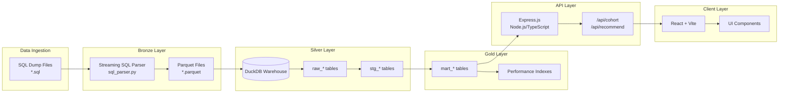

# Architecture Documentation

## System Architecture

The osu! recommender system follows a medallion data architecture (Bronze-Silver-Gold) with a modern web stack for the application layer.

## Data Flow



## Data Architecture Layers

### Bronze Layer: Raw Data Storage

**Purpose**: Store raw data in an efficient, queryable format

**Components**:
- **Streaming SQL Parser** (`sql_parser.py`): State machine parser for SQL INSERT statements
- **Parquet Writer** (`parquet_writer.py`): Writes Arrow RecordBatches to sharded Parquet files

**Data Format**:
```
data/ingest/2026-02/bronze_parquet/
├── scores/
│   ├── part-000000.parquet
│   ├── part-000001.parquet
│   └── manifest.json
├── beatmaps/
└── beatmapsets/
```

**Key Features**:
- Streaming parsing (memory-efficient for large SQL dumps)
- Automatic type inference
- Sharded files (2M rows per file default)
- Snappy compression
- Manifest generation with checksums

### Silver Layer: Staging Tables

**Purpose**: Clean and filter raw data

**Tables**:

| Table | Description | Source |
|-------|-------------|--------|
| `raw_scores` | Loaded from Parquet | Bronze layer |
| `raw_beatmaps` | Beatmap metadata | Bronze layer |
| `raw_beatmapsets` | Beatmap set metadata | Bronze layer |
| `stg_scores` | Filtered to playmode=0 | raw_scores |

**Transformations**:
```sql
-- stg_scores creation
CREATE TABLE stg_scores AS
SELECT 
    id, user_id, beatmap_id, score, pp, playmode,
    data, mods_key, speed_mod
FROM raw_scores
WHERE playmode = 0  -- osu!standard only
```

### Gold Layer: Analytics-Ready Tables

**Purpose**: Precomputed tables optimized for recommendation queries

**Tables**:

#### mart_best_scores
Deduplicated best scores per user/beatmap/mods combination.

```sql
CREATE TABLE mart_best_scores AS
SELECT 
    id, user_id, beatmap_id, score, pp, data, mods_key, speed_mod
FROM (
    SELECT *,
        ROW_NUMBER() OVER (
            PARTITION BY user_id, beatmap_id, mods_key 
            ORDER BY pp DESC
        ) as rn
    FROM stg_scores
) ranked
WHERE rn = 1
```

#### mart_user_topk
Top 100 scores per user per speed modifier.

```sql
CREATE TABLE mart_user_topk AS
SELECT 
    id, user_id, beatmap_id, score, pp, data, mods_key, speed_mod
FROM (
    SELECT *,
        ROW_NUMBER() OVER (
            PARTITION BY user_id, speed_mod 
            ORDER BY pp DESC
        ) as rn
    FROM mart_best_scores
) ranked
WHERE rn <= 100
```

#### mart_beatmap_user_sets
**Critical for sub-second performance**. Precomputed beatmap statistics with user arrays.

```sql
CREATE TABLE mart_beatmap_user_sets AS
SELECT 
    beatmap_id,
    mods_key,
    ARRAY_AGG(user_id) as user_ids,      -- For fast overlap calculation
    COUNT(*) as user_count,
    AVG(pp) as avg_pp,
    STDDEV(pp) as std_pp,
    MIN(pp) as min_pp,
    PERCENTILE_CONT(0.5) WITHIN GROUP (ORDER BY pp) as median_pp,
    PERCENTILE_CONT(0.75) WITHIN GROUP (ORDER BY pp) as p75_pp,
    PERCENTILE_CONT(0.9) WITHIN GROUP (ORDER BY pp) as p90_pp
FROM mart_best_scores
GROUP BY beatmap_id, mods_key
```

**Performance Indexes**:
```sql
-- Index for cohort extraction (beatmap_id filter)
CREATE INDEX idx_mart_best_scores_beatmap_lookup 
ON mart_best_scores(beatmap_id, pp, mods_key, user_id)

-- Index for cohort score retrieval (user_id filter)
CREATE INDEX idx_mart_best_scores_user_lookup 
ON mart_best_scores(user_id, beatmap_id, pp)
```

## Recommendation Algorithm

### 1. Cohort Extraction

Given a seed beatmap, extract users who played it:

```sql
SELECT DISTINCT user_id
FROM mart_best_scores
WHERE beatmap_id = ?
  AND pp BETWEEN ? AND ?
  AND mods_key = ?  -- optional
```

### 2. Cohort Caching

For performance, cohort users are cached in a temp table:

```sql
CREATE TEMPORARY TABLE mart_cohort_cache (
    user_id INTEGER PRIMARY KEY
)
```

This avoids large IN clauses and enables efficient ARRAY overlap operations.

### 3. Recommendation Query

Using the precomputed `mart_beatmap_user_sets` table:

```sql
WITH candidate_beatmaps AS (
    SELECT
        beatmap_id,
        mods_key,
        user_count,
        avg_pp,
        -- Calculate overlap using ARRAY overlap (O(n) vs O(n*m))
        (SELECT COUNT(*) FROM mart_cohort_cache c
         WHERE c.user_id = ANY(bus.user_ids)) as cohort_overlap
    FROM mart_beatmap_user_sets bus
    WHERE user_count >= ?  -- min_total_players
)
SELECT
    cb.beatmap_id,
    b.version,
    bs.artist,
    bs.title,
    cb.cohort_overlap,
    cb.avg_pp,
    -- Novelty score: inverse of cohort overlap
    (1.0 - (cb.cohort_overlap::FLOAT / cb.user_count)) as novelty_score
FROM candidate_beatmaps cb
JOIN raw_beatmaps b ON cb.beatmap_id = b.beatmap_id
JOIN raw_beatmapsets bs ON b.beatmapset_id = bs.beatmapset_id
WHERE cb.cohort_overlap >= ?  -- min_cohort_overlap
ORDER BY
    cb.cohort_overlap DESC,
    cb.avg_pp DESC
LIMIT ?
```

### 4. Ranking Strategy

Recommendations are ranked by:
1. **Cohort Overlap** (descending): More cohort users = more relevant
2. **Average PP** (descending): Higher performance = better match

**Novelty Score**: Calculated as `1 - (cohort_overlap / total_players)` to identify niche maps.

## API Architecture

### Express.js Backend

**File**: `server/src/index.ts`

**Middleware**:
- CORS: Cross-origin requests from React dev server
- JSON body parser
- Error handling middleware

**Database Connection**:
```typescript
// Lazy initialization with caching
async function getDb() {
  if (!dbInstance) {
    const duckdb = await import('@duckdb/node-api');
    dbInstance = await duckdb.DuckDBInstance.create(absolutePath);
  }
  return dbInstance;
}
```

**Endpoints**:

| Endpoint | Method | Description |
|----------|--------|-------------|
| `/health` | GET | Health check |
| `/api/cohort` | POST | Get cohort statistics |
| `/api/recommend` | POST | Get recommendations |
| `/api/beatmaps` | POST | Batch beatmap lookup |
| `/api/user/:id` | GET | User profile |

## Frontend Architecture

### React + Vite Stack

**Build Tool**: Vite (fast dev server, optimized builds)
**Styling**: Tailwind CSS
**Testing**: Vitest + React Testing Library

### Component Structure

```
app/src/
├── components/
│   ├── SeedInput.tsx          # Beatmap ID input
│   ├── CohortPreview.tsx      # Cohort statistics display
│   ├── RecommendationsList.tsx # Recommendation results
│   └── BeatmapCard.tsx        # Individual beatmap display
├── api.ts                     # API client functions
├── App.tsx                    # Main application
└── main.tsx                   # Entry point
```

### State Flow

```
User Input (SeedInput)
    ↓
API Call (api.ts)
    ↓
Cohort Data → CohortPreview
    ↓
Recommendations API
    ↓
RecommendationsList → BeatmapCard[]
```

## Performance Optimizations

### 1. Precomputed Tables

The `mart_beatmap_user_sets` table is the key optimization:
- **Without**: Join scores table, group by beatmap, calculate stats on every query
- **With**: Precomputed stats, O(1) lookup, ARRAY overlap for fast cohort matching

### 2. Strategic Indexing

Indexes on frequently filtered columns:
- `beatmap_id` for cohort extraction
- `user_id` for cohort score retrieval

### 3. Temp Table Caching

Large cohorts (1000+ users) are cached in temp tables:
- Avoids large IN clauses (parameter limits)
- Enables ARRAY overlap operations
- Automatic cleanup after query

### 4. Streaming Parser

SQL dumps are parsed in a streaming fashion:
- Constant memory usage regardless of file size
- Batch processing (100K rows per batch)
- State machine for robust parsing

### 5. Parquet Sharding

Large tables are split into multiple Parquet files:
- Parallel processing
- Efficient columnar storage
- Predicate pushdown support

## Data Lineage

```
SQL Dump
    ↓ (sql_parser.py - streaming parse)
Arrow RecordBatch
    ↓ (parquet_writer.py - batch write)
Parquet Files (Bronze)
    ↓ (duckdb_pipeline.py - CTAS)
raw_scores (Silver)
    ↓ (WHERE playmode = 0)
stg_scores (Silver)
    ↓ (ROW_NUMBER deduplication)
mart_best_scores (Gold)
    ↓ (Top 100 per user)
mart_user_topk (Gold)
    ↓ (ARRAY_AGG, percentiles)
mart_beatmap_user_sets (Gold)
    ↓ (API queries)
Recommendations
```

## Scaling Considerations

### Current Design

- Single-node DuckDB (embedded)
- File-based storage
- In-memory indexes

### Potential Scaling Paths

1. **DuckDB-WASM**: Client-side queries for smaller datasets
2. **DuckDB Cloud**: Managed DuckDB for larger datasets
3. **PostgreSQL**: Migration path if write concurrency needed
4. **Read Replicas**: Multiple API servers with shared storage

## Security Considerations

- **SQL Injection**: All queries use parameterized statements
- **Input Validation**: Type checking on all API inputs
- **Rate Limiting**: Should be added at reverse proxy level
- **CORS**: Currently permissive for development

## Monitoring & Observability

Recommended metrics to track:
- Query latency (p50, p95, p99)
- Cohort size distribution
- Cache hit rates
- Database connection pool usage
- API error rates
