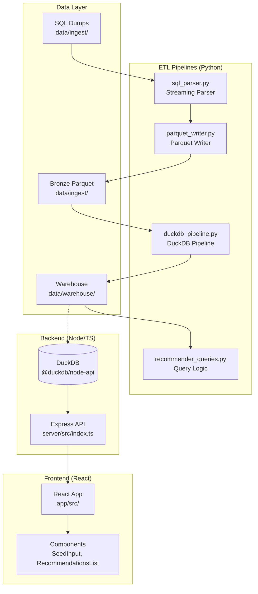

# osu! Beatmap Recommender System

A full-stack recommendation system for osu! beatmaps using collaborative filtering. Built with Python (ETL pipelines), Node.js/TypeScript (backend API), and React (frontend).

## Overview

This system provides personalized beatmap recommendations based on collaborative filtering:

1. **Seed Selection**: User selects a beatmap they enjoy
2. **Cohort Extraction**: System finds all users who played that beatmap with similar performance
3. **Recommendation Generation**: System finds other beatmaps played by the cohort
4. **Ranking**: Results are ranked by cohort overlap and performance metrics

### Key Features

- **Streaming SQL Parser**: Memory-efficient parsing of large SQL dump files
- **Bronze-Silver-Gold Architecture**: Medallion data architecture with DuckDB
- **Sub-second Query Performance**: Precomputed tables and optimized indexes
- **RESTful API**: Express.js backend with TypeScript
- **Modern Frontend**: React + Vite + Tailwind CSS

## Architecture



## Project Structure

```
/run/media/work/OS/ppExtender/
├── data/
│   ├── ingest/2026-02/sql/          # SQL dump files
│   ├── ingest/2026-02/bronze_parquet/  # Parquet bronze layer
│   └── warehouse/2026-02/           # DuckDB database
├── pipelines/                       # Python ETL
│   ├── sql_parser.py               # Streaming SQL parser
│   ├── parquet_writer.py           # Parquet file writer
│   ├── duckdb_pipeline.py          # DuckDB pipeline
│   └── recommender_queries.py      # Query logic
├── server/                          # Node/TS Backend
│   └── src/
│       └── index.ts                # Express API
├── app/                             # React Frontend
│   └── src/
│       ├── components/             # React components
│       │   ├── SeedInput.tsx
│       │   ├── CohortPreview.tsx
│       │   ├── RecommendationsList.tsx
│       │   └── BeatmapCard.tsx
│       ├── api.ts                  # API client
│       └── App.tsx
└── tests/                          # Python tests
    ├── test_sql_parser.py
    ├── test_parquet_writer.py
    ├── test_duckdb_pipeline.py
    └── test_recommender_queries.py
```

## Setup Instructions

### Prerequisites

- Python 3.10+
- Node.js 18+
- npm or yarn

### Python Environment Setup

```bash
# Create virtual environment
python -m venv venv

# Activate virtual environment
source venv/bin/activate  # Linux/Mac
# or
venv\Scripts\activate     # Windows

# Install dependencies
pip install pyarrow duckdb
```

### Node.js Backend Setup

```bash
cd server

# Install dependencies
npm install

# Run in development mode
npm run dev

# Build for production
npm run build

# Start production server
npm start
```

### React Frontend Setup

```bash
cd app

# Install dependencies
npm install

# Run development server
npm run dev

# Build for production
npm run build

# Run tests
npm test
```

## Running the Pipeline

### 1. Parse SQL to Parquet (Bronze Layer)

```bash
# From project root, with venv activated
python -c "
from pipelines.sql_parser import parse_sql_file
from pipelines.parquet_writer import write_parquet_batches

batches = parse_sql_file('data/ingest/2026-02/sql/scores.sql', 'scores')
manifest = write_parquet_batches(
    batches,
    'data/ingest/2026-02/bronze_parquet/scores',
    'scores'
)
print(f'Wrote {manifest[\"total_rows\"]} rows')
"
```

### 2. Load to DuckDB (Silver/Gold Layers)

```bash
python -c "
from pipelines.duckdb_pipeline import create_pipeline

manifest = create_pipeline(
    parquet_dir='data/ingest/2026-02/bronze_parquet',
    warehouse_dir='data/warehouse/2026-02'
)
print(manifest)
"
```

### 3. Run Full Pipeline

```bash
# The pipeline creates these tables:
# - raw_scores: Loaded from Parquet
# - stg_scores: Filtered to playmode=0 (osu!standard)
# - mart_best_scores: Deduplicated best scores per user/beatmap/mods
# - mart_user_topk: Top 100 scores per user
# - mart_beatmap_user_sets: Precomputed beatmap statistics with ARRAY_AGG
```

## API Documentation

### Base URL

```
http://localhost:3000
```

### Endpoints

#### Health Check

```http
GET /health
```

Response:
```json
{
  "status": "ok",
  "database": "connected"
}
```

#### Get Cohort

```http
POST /api/cohort
Content-Type: application/json

{
  "beatmap_id": 12345,
  "pp_lower": 0,
  "pp_upper": 10000,
  "mods": ["DT", "HR"]
}
```

Response:
```json
{
  "beatmap_id": 12345,
  "cohort_size": 150,
  "pp_distribution": {
    "min": 200.5,
    "max": 450.8,
    "mean": 325.4,
    "median": 320.1
  }
}
```

#### Get Recommendations

```http
POST /api/recommend
Content-Type: application/json

{
  "beatmap_id": 12345,
  "pp_lower": 0,
  "pp_upper": 10000,
  "mods": ["DT"],
  "limit": 10
}
```

Response:
```json
{
  "beatmap_id": 12345,
  "total": 10,
  "recommendations": [
    {
      "beatmap_id": 67890,
      "title": "Song Title",
      "artist": "Artist Name",
      "version": "Hard",
      "creator": "Mapper",
      "difficulty_rating": 4.5,
      "bpm": 180,
      "total_length": 120,
      "play_count": 85,
      "avg_pp": 320.5,
      "avg_accuracy": 98.5,
      "similarity_score": 0.57
    }
  ]
}
```

#### Get Beatmaps (Batch)

```http
POST /api/beatmaps
Content-Type: application/json

{
  "beatmap_ids": [12345, 67890, 11111]
}
```

Response:
```json
{
  "beatmaps": [
    {
      "beatmap_id": 12345,
      "title": "Song Title",
      "artist": "Artist Name",
      "version": "Hard",
      "creator": "Mapper",
      "difficulty": 4.5,
      "bpm": 180,
      "total_length": 120,
      "mode": 0,
      "status": 1
    }
  ]
}
```

#### Get User

```http
GET /api/user/:id
```

Response:
```json
{
  "user_id": 12345,
  "stats": {
    "total_plays": 50,
    "average_pp": 285.4,
    "peak_rank": null
  },
  "top_plays": [
    {
      "beatmap_id": 67890,
      "title": "Song Title",
      "artist": "Artist Name",
      "version": "Hard",
      "pp": 450.2,
      "mods": "DT,HR",
      "accuracy": 98.5,
      "score": 1000000,
      "playcount": 5
    }
  ]
}
```

### Error Responses

All endpoints return consistent error formats:

```json
{
  "error": "Error message description"
}
```

Common HTTP status codes:
- `400` - Bad Request (invalid parameters)
- `404` - Not Found (beatmap/user not found)
- `413` - Payload Too Large (batch size exceeded)
- `500` - Internal Server Error

## Testing Instructions

### Python Tests

```bash
# Run all Python tests
pytest tests/

# Run specific test file
pytest tests/test_sql_parser.py
pytest tests/test_parquet_writer.py
pytest tests/test_duckdb_pipeline.py
pytest tests/test_recommender_queries.py

# Run with coverage
pytest tests/ --cov=pipelines --cov-report=html
```

### Node.js Backend Tests

```bash
cd server
npm test
```

### React Frontend Tests

```bash
cd app
npm test
```

## Environment Variables

### Backend

| Variable | Description | Default |
|----------|-------------|---------|
| `PORT` | Server port | 3000 |
| `DUCKDB_PATH` | Path to DuckDB database | `data/warehouse/2026-02/osu.duckdb` |

## Performance Optimizations

The system implements several optimizations for sub-second query performance:

1. **Precomputed Tables**: `mart_beatmap_user_sets` with ARRAY_AGG for fast overlap calculation
2. **Strategic Indexes**: Indexes on `beatmap_id` and `user_id` for cohort extraction
3. **Temp Table Caching**: Cohort users cached in temp tables to avoid large IN clauses
4. **Streaming Parser**: Memory-efficient SQL parsing for large datasets
5. **Parquet Sharding**: Files split by row count for efficient processing

## License

MIT
