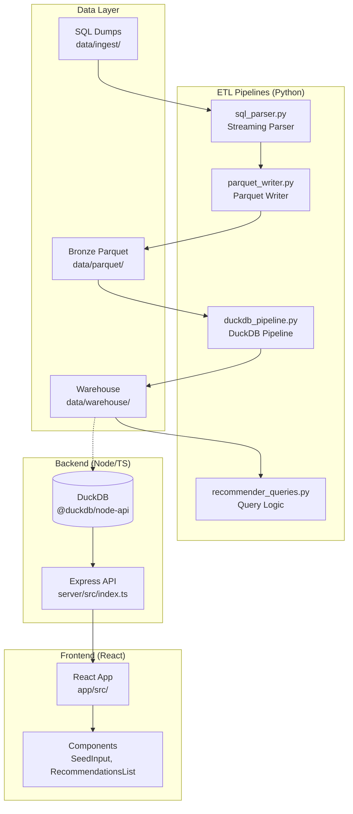

# osu! Beatmap Recommender System

A full-stack recommendation system for osu! beatmaps using collaborative filtering. Built with Python (ETL pipelines), Node.js/TypeScript (backend API), and React (frontend).

## Overview

This system provides personalized beatmap recommendations based on collaborative filtering:

1. **Seed Selection**: User selects a beatmap they enjoy
2. **Cohort Extraction**: System finds all users who played that beatmap with similar performance
3. **Recommendation Generation**: System finds other beatmaps played by the cohort
4. **Ranking**: Results are ranked by cohort overlap and performance metrics

### Key Features

- **Streaming SQL Parser**: Memory-efficient parsing of large SQL dump files
- **Bronze-Silver-Gold Architecture**: Medallion data architecture with DuckDB
- **Sub-second Query Performance**: Precomputed tables and optimized indexes
- **Type-Safe APIs**: tRPC provides end-to-end type safety across full stack
- **Modern Frontend**: React + Vite + Tailwind CSS v4

## Tech Stack

**ETL (Data Pipelines):**
- Python 3.10+
- Pydantic v2 (schema validation)
- PyArrow (columnar data)
- DuckDB (warehouse database)

**Backend (API Server):**
- Bun 1.3+ (JavaScript runtime) - NEW
- tRPC v11 (type-safe APIs) - NEW
- DuckDB Node Neo (database client)
- Vitest (testing framework)

**Frontend (React Application):**
- React 19.2.0
- TypeScript 5.3+
- Vite 7.2.4+ (build tool)
- Tailwind CSS v4.1.18+ (styling)
- Nivo 0.99.0 (data visualization)
- TanStack Query v5 (server state management) - NEW
- Vitest (testing framework)

**Build Tools:**
- Turborepo 2.0+ (monorepo orchestrator)
- Bun (package manager and runtime) - NEW
- TypeScript 5.3+ (type checking)

## Architecture


```mermaid
flowchart TB
    subgraph Data["Data Layer"]
        SQL["SQL Dumps<br/>data/ingest/"]
        Parquet["Bronze Parquet<br/>data/parquet/"]
        DuckDB["Warehouse<br/>data/warehouse/"]
    end

    subgraph Pipelines["ETL Pipelines (Python)"]
        Parser["sql_parser.py<br/>Streaming Parser"]
        Writer["parquet_writer.py<br/>Parquet Writer"]
        Pipeline["duckdb_pipeline.py<br/>DuckDB Pipeline"]
        Queries["recommender_queries.py<br/>Query Logic"]
    end

    subgraph Backend["Backend (Node/TS)"]
        API["Express API<br/>server/src/index.ts"]
        DB[("DuckDB<br/>@duckdb/node-api")]
    end

    subgraph Frontend["Frontend (React)"]
        UI["React App<br/>app/src/"]
        Components["Components<br/>SeedInput, RecommendationsList"]
    end

    SQL --> Parser --> Writer --> Parquet
    Parquet --> Pipeline --> DuckDB
    DuckDB --> Queries
    DuckDB -.-> DB
    DB --> API
    API --> UI
    UI --> Components
```

## Project Structure

```
/run/media/work/OS/ppExtender/
├── data/
│   ├── ingest/2026-02/sql/          # SQL dump files
│   ├── parquet/                     # Parquet files (exported from MySQL)
│   └── warehouse/2026-02/           # DuckDB database
├── pipelines/                       # Python ETL
│   ├── sql_parser.py               # Streaming SQL parser
│   ├── parquet_writer.py           # Parquet file writer
│   ├── duckdb_pipeline.py          # DuckDB pipeline
│   ├── run_pipeline.py             # Full pipeline orchestrator
│   └── recommender_queries.py      # Query logic
├── scripts/                         # Utility scripts
│   ├── import_with_monitoring.sh   # MySQL import with optimizations
│   ├── export_to_parquet.sh        # MySQL to Parquet export
│   ├── final_import_all_tables.sh  # Complete import pipeline
│   └── recover_mariadb.sh          # MariaDB recovery utility
├── server/                          # Node/TS Backend
│   └── src/
│       └── index.ts                # Express API
├── app/                             # React Frontend
│   └── src/
│       ├── components/             # React components
│       │   ├── SeedInput.tsx
│       │   ├── CohortPreview.tsx
│       │   ├── RecommendationsList.tsx
│       │   └── BeatmapCard.tsx
│       ├── api.ts                  # API client
│       └── App.tsx
└── tests/                          # Python tests
    ├── test_sql_parser.py
    ├── test_parquet_writer.py
    ├── test_duckdb_pipeline.py
    └── test_recommender_queries.py
```

## Quick Start

### Prerequisites

- Python 3.10+
- Node.js 18+
- MariaDB/MySQL (for initial data import)
- npm or yarn

### Python Environment Setup

```bash
# Create virtual environment
python -m venv venv

# Activate virtual environment
source venv/bin/activate  # Linux/Mac
# or
venv\Scripts\activate     # Windows

# Install dependencies
pip install pyarrow duckdb
```

### Node.js Backend Setup

```bash
cd server

# Install dependencies
npm install

# Run in development mode
npm run dev

# Build for production
npm run build

# Start production server
npm start
```

### React Frontend Setup

```bash
cd app

# Install dependencies
npm install

# Run development server
npm run dev

# Build for production
npm run build

# Run tests
npm test
```

## Data Pipeline Workflow

### Phase 1: Import SQL to MySQL (One-time setup)

Import osu! SQL dumps into MariaDB with optimizations:

```bash
# Import a single table with monitoring
./scripts/import_with_monitoring.sh --table scores --force

# Or import all tables (requires sudo for MariaDB config)
sudo ./scripts/final_import_all_tables.sh
```

**Key Features:**
- Session optimizations applied (unique_checks=0, foreign_key_checks=0, autocommit=0)
- Real-time progress monitoring with INSERT statement tracking
- Estimated time remaining with margin of error
- Global optimizations: innodb_flush_log_at_trx_commit=0, innodb_doublewrite=0

**Performance:**
- Small tables (<100MB): <1 minute
- Medium tables (1-5GB): 1-3 hours
- Large tables (20GB+ scores): 6-12 hours

### Phase 2: Export MySQL to Parquet

Export all MySQL tables to optimized Parquet format:

```bash
# Export all tables (requires sudo)
sudo ./scripts/export_to_parquet.sh --all

# Or export specific tables
sudo ./scripts/export_to_parquet.sh --table scores --table osu_beatmaps

# List available tables
sudo ./scripts/export_to_parquet.sh --list
```

**Export Optimizations:**
- `PER_THREAD_OUTPUT`: Parallel writing via DuckDB's 16 threads
- ZSTD compression (level 3): 4-12x compression ratio
- Row group size: 1M rows / 16MB
- Performance settings: preserve_insertion_order=false, filter_pushdown=true

**Output Structure:**
```
data/parquet/
├── scores/
│   └── data.parquet/
│       └── data_0.parquet (2.8GB, 62M rows)
├── osu_scores_high/
│   └── data.parquet/
│       └── data_0.parquet (1.3GB, 58M rows)
└── ... (other tables)
```

**Performance:**
- Export speed: 3.9-4.5 MB/s
- Total time for 39GB SQL: ~3 hours
- Final Parquet size: ~4.8GB (8x compression)

### Phase 3: Run ETL Pipeline (Silver + Gold)

Load Parquet files into DuckDB and create analytics tables:

```bash
# Skip bronze (already done via export script), run silver + gold only
python pipelines/run_pipeline.py --phase silver   # Parquet → DuckDB raw tables
python pipelines/run_pipeline.py --phase gold     # Raw → Staging → Mart tables

# Or run both phases together
python pipelines/run_pipeline.py --phase silver && python pipelines/run_pipeline.py --phase gold

# Dry run to see what would be executed
python pipelines/run_pipeline.py --phase silver --dry-run
```

**Pipeline Stages:**

1. **Bronze**: SQL → Parquet (done via `export_to_parquet.sh`, skip in Python pipeline)
2. **Silver**: Load Parquet → DuckDB raw tables
   - `raw_scores`: All scores data
   - `raw_osu_beatmaps`: Beatmap metadata
   - `raw_osu_beatmapsets`: Beatmap set metadata
   - etc.

3. **Gold**: Create analytics-ready tables
   - `stg_scores`: Filtered to playmode=0 (osu!standard)
   - `mart_best_scores`: Deduplicated best scores per user/beatmap/mods
   - `mart_user_topk`: Top 100 scores per user
   - `mart_beatmap_user_sets`: Precomputed beatmap statistics

**Performance:**
- Silver phase: ~5-10 minutes
- Gold phase: ~2-5 minutes
- Total pipeline: ~10-15 minutes

## API Documentation

### Base URL

```
http://localhost:3000
```

### Endpoints

#### Health Check

```http
GET /health
```

Response:
```json
{
  "status": "ok",
  "database": "connected"
}
```

#### Get Cohort

```http
POST /api/cohort
Content-Type: application/json

{
  "beatmap_id": 12345,
  "pp_lower": 0,
  "pp_upper": 10000,
  "mods": ["DT", "HR"]
}
```

Response:
```json
{
  "beatmap_id": 12345,
  "cohort_size": 150,
  "pp_distribution": {
    "min": 200.5,
    "max": 450.8,
    "mean": 325.4,
    "median": 320.1
  }
}
```

#### Get Recommendations

```http
POST /api/recommend
Content-Type: application/json

{
  "beatmap_id": 12345,
  "pp_lower": 0,
  "pp_upper": 10000,
  "mods": ["DT"],
  "limit": 10
}
```

Response:
```json
{
  "beatmap_id": 12345,
  "total": 10,
  "recommendations": [
    {
      "beatmap_id": 67890,
      "title": "Song Title",
      "artist": "Artist Name",
      "version": "Hard",
      "creator": "Mapper",
      "difficulty_rating": 4.5,
      "bpm": 180,
      "total_length": 120,
      "play_count": 85,
      "avg_pp": 320.5,
      "avg_accuracy": 98.5,
      "similarity_score": 0.57
    }
  ]
}
```

#### Get Beatmaps (Batch)

```http
POST /api/beatmaps
Content-Type: application/json

{
  "beatmap_ids": [12345, 67890, 11111]
}
```

Response:
```json
{
  "beatmaps": [
    {
      "beatmap_id": 12345,
      "title": "Song Title",
      "artist": "Artist Name",
      "version": "Hard",
      "creator": "Mapper",
      "difficulty": 4.5,
      "bpm": 180,
      "total_length": 120,
      "mode": 0,
      "status": 1
    }
  ]
}
```

#### Get User

```http
GET /api/user/:id
```

Response:
```json
{
  "user_id": 12345,
  "stats": {
    "total_plays": 50,
    "average_pp": 285.4,
    "peak_rank": null
  },
  "top_plays": [
    {
      "beatmap_id": 67890,
      "title": "Song Title",
      "artist": "Artist Name",
      "version": "Hard",
      "pp": 450.2,
      "mods": "DT,HR",
      "accuracy": 98.5,
      "score": 1000000,
      "playcount": 5
    }
  ]
}
```

### Error Responses

All endpoints return consistent error formats:

```json
{
  "error": "Error message description"
}
```

Common HTTP status codes:
- `400` - Bad Request (invalid parameters)
- `404` - Not Found (beatmap/user not found)
- `413` - Payload Too Large (batch size exceeded)
- `500` - Internal Server Error

## Testing Instructions

### Python Tests

```bash
# Run all Python tests
pytest tests/

# Run specific test file
pytest tests/test_sql_parser.py
pytest tests/test_parquet_writer.py
pytest tests/test_duckdb_pipeline.py
pytest tests/test_recommender_queries.py

# Run with coverage
pytest tests/ --cov=pipelines --cov-report=html
```

### Node.js Backend Tests

```bash
cd server
npm test
```

### React Frontend Tests

```bash
cd app
npm test
# or
bun run test
# or shorthand
bun t
```

**Note on `bun test`**: The command `bun test` runs Bun's native test runner which doesn't support Vitest's jsdom environment. Always use `bun run test`, `bun t`, or `npm test` instead.

## Environment Variables

### Backend

| Variable | Description | Default |
|----------|-------------|---------|
| `PORT` | Server port | 3000 |
| `DUCKDB_PATH` | Path to DuckDB database | `data/warehouse/2026-02/osu.duckdb` |

## Performance Optimizations

The system implements several optimizations for sub-second query performance:

1. **Precomputed Tables**: `mart_beatmap_user_sets` with ARRAY_AGG for fast overlap calculation
2. **Strategic Indexes**: Indexes on `beatmap_id` and `user_id` for cohort extraction
3. **Temp Table Caching**: Cohort users cached in temp tables to avoid large IN clauses
4. **Streaming Parser**: Memory-efficient SQL parsing for large datasets
5. **Parquet Sharding**: Files split by row count for efficient processing
6. **Columnar Compression**: ZSTD compression with optimized row group sizes
7. **Parallel Export**: PER_THREAD_OUTPUT for maximum DuckDB throughput

## Data Statistics

Final dataset after full pipeline:
- **Total Rows**: 361,607,855
- **Scores**: 62,262,950 rows
- **Parquet Size**: ~4.8GB (compressed from ~39GB SQL)
- **Compression Ratio**: 8x

## License

MIT
